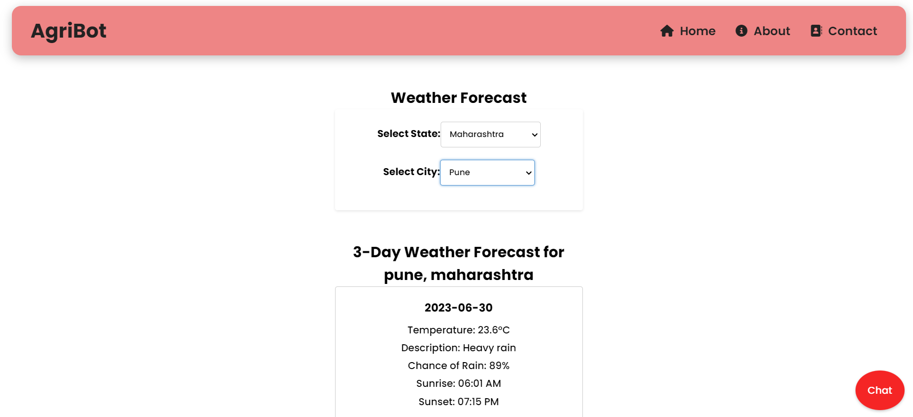

# React-Flask AI Project

## AgriBot: An AI-Powered Farmer's Companion

A web application built with React and Flask, providing weather forecast, farming information using an APIs.

## Prerequisites

Before running the project, make sure you have the following prerequisites installed:

- Node.js
- Python
- Flask
- TensorFlow
- Joblib

1. Open your browser and visit http://localhost:3000 to access the AI chatbot for farmers.
   

2. Weather forecasting
 

# Technologies
* React
* Flask
* TensorFlow

# Contributing
Contributions are welcome! If you find any issues or have suggestions for improvements, please open an issue or submit a pull request.

